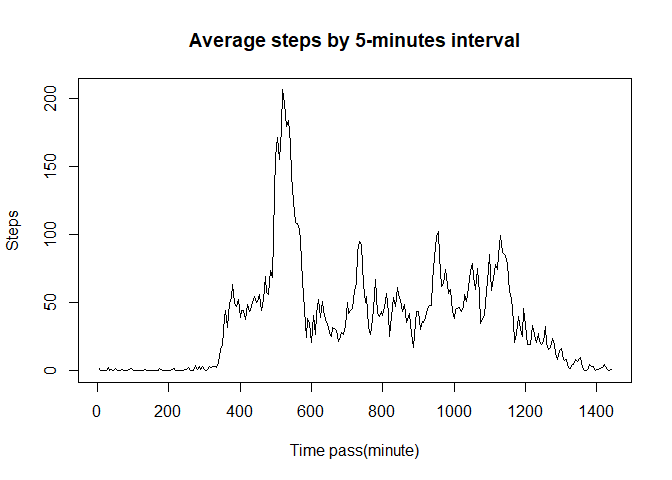

## Loading and preprocessing the data

```r
activity <- read.csv("activity/activity.csv")
head(activity)
```

```
##   steps       date interval
## 1    NA 2012-10-01        0
## 2    NA 2012-10-01        5
## 3    NA 2012-10-01       10
## 4    NA 2012-10-01       15
## 5    NA 2012-10-01       20
## 6    NA 2012-10-01       25
```
Transformed "date" as factor datatype  


## What is mean total number of steps taken per day?


```r
total_step_per_day <- aggregate(activity$steps, by=list(date = activity$date), sum, na.rm = TRUE)
barplot(total_step_per_day$x)
```

<!-- -->

```r
step_mean <- mean(total_step_per_day$x)
print(step_mean)
```

```
## [1] 9354.23
```

```r
step_median <- median(total_step_per_day$x)
print(step_median)
```

```
## [1] 10395
```
The mean of steps per day is 9354.23  
And the median is 10395  


## What is the average daily activity pattern?

```r
steps_mean_by_time <- aggregate(activity$steps, by=list(time = activity$interval), mean, na.rm = TRUE)

plot((5 * 1:nrow(steps_mean_by_time)), steps_mean_by_time$x, type = "l", xlab = "Time pass(minute)", ylab = "Steps", main = "Average steps by 5-minutes interval")
```

<!-- -->

```r
max_index <- which.max(steps_mean_by_time$x)
print(steps_mean_by_time$time[max_index])
```

```
## [1] 835
```
**The value 835** is 8:35 ~ 8:40  
The maximum number of steps is between 8:35 and 8:40 near half past 8  

## Imputing missing values

```r
count_NA <- sum(is.na(activity$steps))
print(count_NA)
```

```
## [1] 2304
```
2304 data are missing value.  
This mean 18 days of total 61 days are missing days.  
  
### Make a new dataset with mean of 5-minute interval

```r
### Create new dataset

activity_no_NA <- activity
for(i in 1:length(activity_no_NA$steps)){
    if(is.na(activity_no_NA$steps[i])){
        activity_no_NA$steps[i] <- round(steps_mean_by_time$x[steps_mean_by_time$time == activity_no_NA$interval[i]], 0)
    }
}

head(activity_no_NA)
```

```
##   steps       date interval
## 1     2 2012-10-01        0
## 2     0 2012-10-01        5
## 3     0 2012-10-01       10
## 4     0 2012-10-01       15
## 5     0 2012-10-01       20
## 6     2 2012-10-01       25
```
Put the mean of each 5-minute-interval on NA  


```r
total_step_per_day_noNA <- aggregate(activity_no_NA$steps, by=list(date = activity_no_NA$date), sum, na.rm = TRUE)
barplot(total_step_per_day_noNA$x)
```

<!-- -->

```r
step_mean_noNA <- mean(total_step_per_day_noNA$x)
print(step_mean_noNA)
```

```
## [1] 10765.64
```

```r
step_median_noNA <- median(total_step_per_day_noNA$x)
print(step_median_noNA)
```

```
## [1] 10762
```
Missing values were calculated as 0 before, but this time have positive value. The mean and median value are higher than before dataset. And they are the same.  


## Are there differences in activity patterns between weekdays and weekends?


```r
### Put the weekend factor on dataset
activity_no_NA$day <- weekdays(as.Date(activity_no_NA$date), FALSE)
activity_no_NA$weekend <- ifelse(activity_no_NA$day == "토요일", "weekend", ifelse(activity_no_NA$day == "일요일", "weekend", "weekday"))


### Make the plot
weekend_only <- activity_no_NA[activity_no_NA$weekend == "weekend", ]
steps_mean_by_time_weekend <- aggregate(weekend_only$steps, by=list(time = weekend_only$interval), mean, na.rm = TRUE)

weekday_only <- activity_no_NA[activity_no_NA$weekend == "weekday", ]
steps_mean_by_time_weekday <- aggregate(weekday_only$steps, by=list(time = weekday_only$interval), mean, na.rm = TRUE)

plot((5 * 1:nrow(steps_mean_by_time_weekend)), steps_mean_by_time_weekend$x, type = "l", xlab = "Time pass(minute)", ylab = "Steps", main = "Average steps by 5-minutes interval", col = "blue", ylim = c(0, 230))
points((5 * 1:nrow(steps_mean_by_time_weekend)), steps_mean_by_time_weekday$x, type = "l", col = "red")
legend("topleft", legend = c("weekend", "weekday"), col = c("blue", "red"), lty = 1)
```

<!-- -->
  
We can see the difference of two line. In morning, mean of weekday is more than weekend, but weekend is more than weekday in afternoon.  
